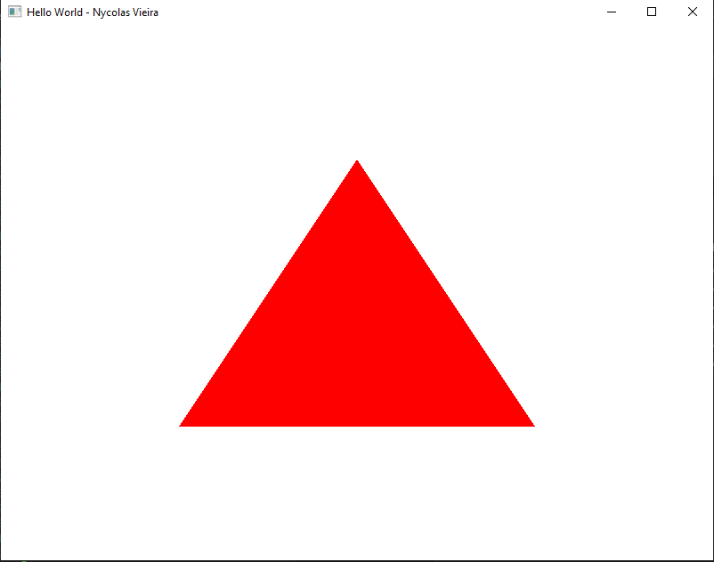

# hello-world-opengl

## Changes from original code:
1. Title name changed for "Hello World - Nycolas Vieira"
```cpp
GLFWwindow* window = glfwCreateWindow(WIDTH, HEIGHT, "Hello World - Nycolas Vieira", nullptr, nullptr);
```

2. Changed background color for white
3. Changed triangule color for red
4. Removed pinks squares points in triangule vertexs
```cpp
while (!glfwWindowShouldClose(window))
{
    glfwPollEvents();

    glClearColor(1.0f, 1.0f, 1.0f, 1.0f);
    glClear(GL_COLOR_BUFFER_BIT);

    glLineWidth(10);
    glPointSize(20);

    glUniform4f(colorLoc, 1.0f, 0.0f, 0.0f, 0.0f);
    glBindVertexArray(VAO);
    glDrawArrays(GL_TRIANGLES, 0, 3);

    glfwSwapBuffers(window);
}
```

5. Remove comments

## FINAL RESULT

